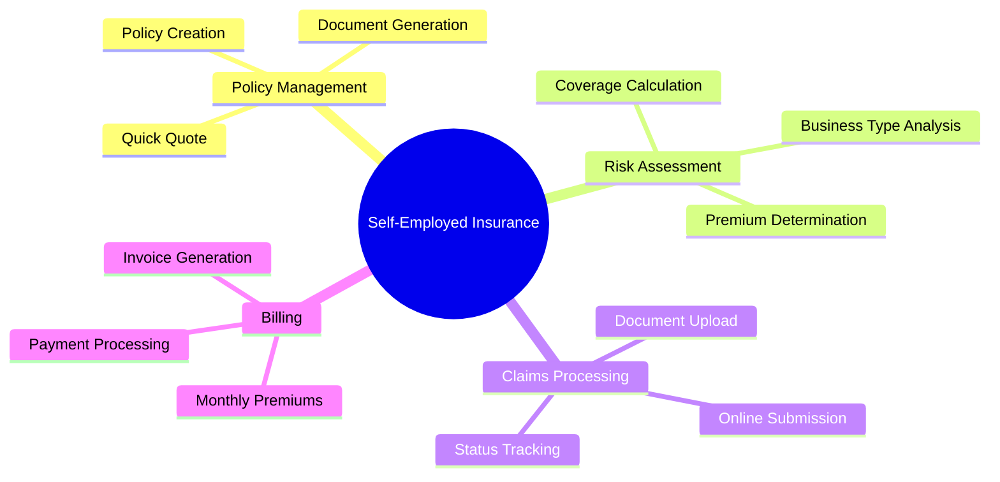
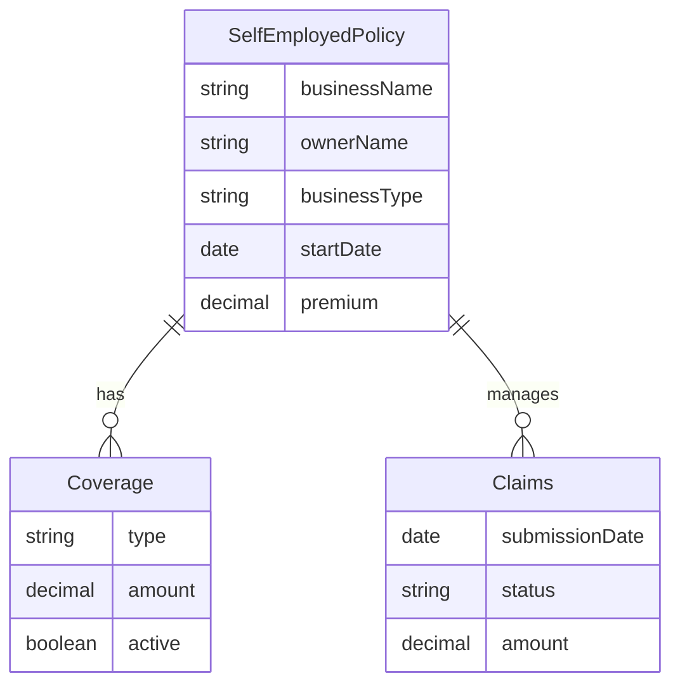
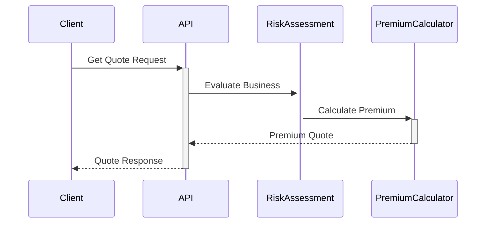

# Java Insurance Software Development Guide 🏢

[](https://spring.io/projects/spring-boot)
[](https://www.oracle.com/java/)
[](https://opensource.org/licenses/MIT)

> A comprehensive guide for developing insurance software systems using Java and modern frameworks.

## 📑 Table of Contents
- [Why Java for Insurance](#-why-java-for-insurance)
- [Technology Stack](#-technology-stack)
- [Development Best Practices](#-development-best-practices)
- [Features Implementation](#-features-implementation)
- [Learning Resources](#-learning-resources)
- [Development Timeline](#-development-timeline)
- [Maintenance Guide](#-maintenance-guide)

## 🚀 Why Java for Insurance

### Enterprise Features 🏗️
<details>
<summary><b>Spring Boot Framework</b></summary>

- ✨ Rapid application development
- 🔒 Built-in security features
- 🔄 Microservices support
- ⚙️ Easy configuration
</details>

<details>
<summary><b>Database Integration</b></summary>

- 🗃️ JPA (Java Persistence API)
- 🔄 Hibernate ORM
- 💪 Strong transaction support
- 🛡️ Data integrity features
</details>

<details>
<summary><b>Scalability</b></summary>

- 📦 Microservices architecture support
- ⚖️ Load balancing capabilities
- 🔄 Clustering support
</details>

### Advantages for C/C++ Developers 🔄
- ✅ Similar syntax to C++
- 🎯 Familiar OOP concepts
- 🗑️ No manual memory management
- 🚫 No pointer manipulation
- ♻️ Automatic garbage collection

### Insurance Industry Benefits 💼
<details>
<summary><b>Security Features</b></summary>

- 🔒 Strong type safety
- 🔐 Built-in encryption support
- 🛡️ Secure data handling
</details>

<details>
<summary><b>Business Features</b></summary>

- 📄 PDF generation
- 📊 Excel/CSV processing
- 📧 Email integration
- 📁 Document management
</details>

## 🛠️ Technology Stack

### Frontend Architecture
\`\`\`mermaid
graph TD
    A[Frontend] --> B[Web-Based]
    A --> C[Desktop]
    B --> D[React/Angular]
    B --> E[TypeScript]
    B --> F[Material-UI/Bootstrap]
    C --> G[JavaFX]
    C --> H[Scene Builder]
\`\`\`

### Backend Stack
\`\`\`mermaid
graph TD
    A[Backend] --> B[Spring Boot]
    A --> C[Database]
    B --> D[Security]
    B --> E[JPA]
    C --> F[PostgreSQL/Oracle]
    C --> G[Redis Cache]
\`\`\`

## 🔒 Security Implementation

### Authentication Flow
\`\`\`mermaid
sequenceDiagram
    Client->>+Server: Login Request
    Server->>+Database: Validate Credentials
    Database-->>-Server: User Data
    Server->>+JWT: Generate Token
    JWT-->>-Server: Access Token
    Server-->>-Client: Return JWT
\`\`\`

## 📋 Development Best Practices

### Code Organization 📁
- 📦 Use proper package structure
- 🏗️ Follow MVC pattern
- 🔧 Implement service layer
- 💉 Use dependency injection

### Database Handling 🗃️
- 🔒 Use prepared statements
- 🏊 Implement connection pooling
- 💼 Handle transactions properly
- 🔄 Use database migrations

## 🎯 Features Implementation

### Core Modules
\`\`\`mermaid
mindmap
  root((Insurance System))
    Users
      Registration
      Authentication
      Profiles
    Policies
      Creation
      Updates
      Documents
    Claims
      Submission
      Tracking
      Assessment
    Reports
      Financial
      Analytics
      Audit
\`\`\`

## 📚 Learning Resources

### Essential Reading 📖
1. [Spring Boot Documentation](https://docs.spring.io/spring-boot/docs/current/reference/html/)
2. [Java Tutorial](https://docs.oracle.com/javase/tutorial/)
3. [Baeldung Spring Guides](https://www.baeldung.com/spring-tutorial)

## ⏱️ Development Timeline

### Project Phases
\`\`\`mermaid
gantt
    title Insurance System Development
    section Setup
    Environment Setup :a1, 2024-01-01, 7d
    Basic Features   :a2, after a1, 14d
    section Core
    Policy Management :b1, after a2, 21d
    Claims Processing :b2, after b1, 21d
    section Final
    Security         :c1, after b2, 14d
    Testing          :c2, after c1, 14d
\`\`\`

## 🔧 Maintenance Guide

### Monitoring Checklist ✅
- [ ] Daily performance checks
- [ ] Weekly security scans
- [ ] Monthly dependency updates
- [ ] Quarterly security audits

---

## 📝 License
This guide is licensed under the MIT License - see the [LICENSE](LICENSE) file for details

## 🤝 Contributing
Feel free to submit issues and enhancement requests!

---
*Made with ❤️ for insurance software developers* 

## 🛠️ Development Tools & Setup

### Essential Development Tools 🔧
<details>
<summary><b>Lombok - Code Generation</b></summary>

```java
// Example: Self-employed Insurance Policy Entity
@Data
@NoArgsConstructor
@AllArgsConstructor
@Entity
public class SelfEmployedPolicy {
    @Id
    @GeneratedValue(strategy = GenerationType.IDENTITY)
    private Long id;
    
    private String businessName;
    private String ownerName;
    private String businessType;
    private LocalDate coverageStartDate;
    private BigDecimal monthlyPremium;
    
    @Enumerated(EnumType.STRING)
    private CoverageType coverageType;
}
```

Benefits:
- ✨ Automatic getter/setter generation
- 📝 Reduced boilerplate code
- 🐛 Fewer bugs from manual code
- 🔄 Easy to maintain
</details>

<details>
<summary><b>JHipster - Application Generator</b></summary>

```bash
# Generate Self-employed Insurance Application
jhipster

# Recommended choices:
- Monolithic application
- PostgreSQL database
- React frontend
- JWT authentication
- REST APIs
```

Generated Features:
- 👤 User management system
- 🔒 Security setup
- 📊 Database configuration
- 📱 Responsive UI
- 📝 API documentation
</details>

### Self-Employed Insurance Application Features 📋

<details>
<summary><b>Core Business Requirements</b></summary>


</details>

### Database Schema for Self-Employed System 🗃️



### API Structure 🔌



### Development Environment Setup 💻

```bash
# Project initialization
spring init --dependencies=web,data-jpa,security,lombok --name=self-employed-insurance

# Essential dependencies in pom.xml
<dependencies>
    <!-- Spring Boot Starter -->
    <dependency>
        <groupId>org.springframework.boot</groupId>
        <artifactId>spring-boot-starter-web</artifactId>
    </dependency>
    
    <!-- Lombok for code generation -->
    <dependency>
        <groupId>org.projectlombok</groupId>
        <artifactId>lombok</artifactId>
        <version>1.18.22</version>
    </dependency>
    
    <!-- Database -->
    <dependency>
        <groupId>org.postgresql</groupId>
        <artifactId>postgresql</artifactId>
    </dependency>
</dependencies>
```

### Quick Start Guide 🚀

1. **Setup Development Environment**:
   ```bash
   # Install required tools
   npm install -g generator-jhipster
   ```

2. **Generate Project Structure**:
   ```bash
   jhipster
   # Select options for self-employed insurance system
   ```

3. **Implement Core Features**:
   ```java
   @RestController
   @RequestMapping("/api/policies")
   public class PolicyController {
       @PostMapping("/quote")
       public QuoteResponse getQuote(@RequestBody BusinessInfo info) {
           // Implementation
       }
   }
   ```

### Best Practices for Insurance Applications ✅

- 🔒 Implement strict data validation
- 📊 Use proper logging for audit trails
- 🔐 Ensure GDPR compliance
- 📄 Generate PDF documents for policies
- 💰 Implement secure payment processing

[previous content continues...] 